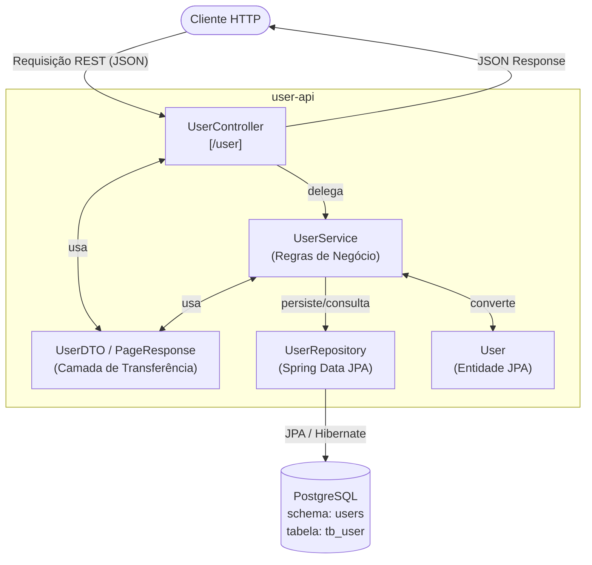

# 👤 user-api

> **Versão:** `0.0.1-SNAPSHOT` &nbsp;|&nbsp; **Java:** `21` &nbsp;|&nbsp; **Spring Boot:** `3.4.5`

Microsserviço responsável por gerenciar os dados dos usuários da plataforma **QuickReader**.  
Faz parte de um ecossistema de microsserviços desenvolvido como projeto de estudo na formação da Alura.

---

## 📐 Arquitetura



---

## 🛠️ Stack Tecnológica

| Tecnologia               | Versão     | Finalidade                                 |
|--------------------------|------------|--------------------------------------------|
| Java                     | 21         | Linguagem principal                        |
| Spring Boot              | 3.4.5      | Framework base da aplicação                |
| Spring Web               | —          | Exposição dos endpoints REST               |
| Spring Data JPA          | —          | Abstração de acesso ao banco de dados      |
| Spring HATEOAS           | —          | Respostas paginadas com hypermedia links   |
| Spring Validation        | —          | Validação dos dados de entrada             |
| Flyway                   | 9.22.0     | Versionamento e migração do banco de dados |
| PostgreSQL Driver        | 42.7.5     | Conector JDBC para PostgreSQL              |
| Lombok                   | —          | Redução de boilerplate (getters/setters)   |
| Maven                    | —          | Gerenciamento de dependências e build      |

---

## 🗂️ Estrutura de Pacotes

```
br.com.quickreader.userapi/
├── controller/
│   └── UserController.java     # Endpoints REST
├── service/
│   └── UserService.java        # Regras de negócio
├── repository/
│   └── UserRepository.java     # Acesso ao banco (JPA)
├── model/
│   └── User.java               # Entidade JPA mapeada para tb_user
├── dto/
│   ├── UserDTO.java            # DTO de transferência de dados do usuário
│   └── PageResponse.java       # DTO genérico para respostas paginadas
└── UserApiApplication.java     # Ponto de entrada da aplicação
```

---

## 🌐 Endpoints REST

Base URL: `http://localhost:8080`

| Método   | Rota                   | Descrição                                      | Parâmetros / Body                     | Status de Retorno |
|----------|------------------------|------------------------------------------------|---------------------------------------|-------------------|
| `GET`    | `/user`                | Lista todos os usuários                        | —                                     | `200 OK`          |
| `GET`    | `/user/{id}`           | Busca usuário por ID                           | `id` *(path)*                         | `200 OK`          |
| `GET`    | `/user/{cpf}/cpf`      | Busca usuário por CPF                          | `cpf` *(path)*                        | `200 OK`          |
| `GET`    | `/user/search`         | Busca usuários pelo nome *(LIKE)*              | `nome` *(query param)*                | `200 OK`          |
| `GET`    | `/user/pageable`       | Lista paginada com HATEOAS links               | `page`, `size`, `sort` *(query)*      | `200 OK`          |
| `GET`    | `/user/page`           | Lista paginada — modelo simples `PageResponse` | `page`, `size`, `sort` *(query)*      | `200 OK`          |
| `GET`    | `/user/`               | Mensagem de boas-vindas                        | —                                     | `200 OK`          |
| `POST`   | `/user`                | Cria um novo usuário                           | `UserDTO` *(body JSON)*               | `201 Created`     |
| `PATCH`  | `/user/{userId}`       | Atualiza dados de um usuário existente         | `userId` *(path)* + `UserDTO` *(body)*| `200 OK`          |
| `DELETE` | `/user/{id}`           | Remove um usuário pelo ID                      | `id` *(path)*                         | `204 No Content`  |

### Exemplo de Body — `POST /user` e `PATCH /user/{userId}`

```json
{
  "nome":     "Renato Brito",
  "cpf":      "123.456.789-00",
  "endereco": "Rua das Flores, 42",
  "email":    "renato@quickreader.com.br",
  "telefone": "11 99999-0000"
}
```

> **Campos obrigatórios:** `nome`, `cpf` e `email` (validados via `@NotBlank`).  
> O campo `dataCadastro` é preenchido automaticamente pela aplicação na criação.

---

## 🗄️ Banco de Dados

### Configuração

| Parâmetro   | Valor         |
|-------------|---------------|
| Banco       | PostgreSQL    |
| Host        | `localhost`   |
| Porta       | `15432`       |
| Database    | `dev`         |
| Schema      | `users`       |
| Tabela      | `tb_user`     |

### Migração — `V1__create_user_table.sql`

O schema e a tabela são criados automaticamente pelo **Flyway** na primeira execução:

```sql
CREATE SCHEMA IF NOT EXISTS users;

CREATE TABLE users.tb_user (
    id            BIGSERIAL    PRIMARY KEY,
    nome          VARCHAR(100) NOT NULL,
    cpf           VARCHAR(100) NOT NULL,
    endereco      VARCHAR(100) NOT NULL,
    email         VARCHAR(100) NOT NULL,
    telefone      VARCHAR(100) NOT NULL,
    data_cadastro TIMESTAMP    NOT NULL
);
```

> ⚠️ **Importante:** a aplicação usa `spring.jpa.hibernate.ddl-auto=validate`.  
> Isso significa que o Hibernate **não cria nem altera** a tabela — apenas valida se ela existe.  
> O **Flyway deve rodar com sucesso** antes da aplicação iniciar. Se o schema `users` ou a tabela `tb_user` não existirem, a aplicação **falhará ao subir**.

### Connection Pool — Hikari

| Parâmetro              | Valor    |
|------------------------|----------|
| `connection-timeout`   | 20000 ms |
| `minimum-idle`         | 5        |
| `maximum-pool-size`    | 5        |
| `auto-commit`          | `true`   |

---

## ▶️ Como Executar Localmente

### Pré-requisitos

- [Java 21](https://adoptium.net/)
- [PostgreSQL](https://www.postgresql.org/) rodando na porta **`15432`** com o banco **`dev`** criado

### Variáveis de Ambiente

| Variável      | Valor padrão | Descrição                  |
|---------------|--------------|----------------------------|
| `DB_USER`     | `postgres`   | Usuário do banco de dados  |
| `DB_PASSWORD` | `Battosai0`  | Senha do banco de dados    |

> 📝 **Nota:** as credenciais padrão estão expostas no `application.properties` intencionalmente,  
> pois este é um **projeto de estudo**. Não há problema em tê-las no repositório.

### Executando

```bash
# Clone o repositório
git clone <url-do-repositorio>
cd user-api

# Execute com Maven Wrapper
./mvnw spring-boot:run

# Ou sobrescrevendo as credenciais via variável de ambiente
DB_USER=meu_usuario DB_PASSWORD=minha_senha ./mvnw spring-boot:run
```

A aplicação estará disponível em: **`http://localhost:8080`**

---

## 🔨 Build

```bash
# Gerar o JAR
./mvnw clean package

# Executar o JAR gerado
java -jar target/user-api-0.0.1-SNAPSHOT.jar
```

---

